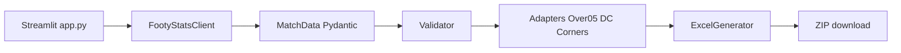

# Plan de implementare Pontifybet MVP

## Ce există astăzi

Proiectul [`C:\_Software\SAAS\Pontifybet`](C:_Software\SAAS\Pontifybet) **nu are încă aplicație**: zero Python, zero Git, zero Docker. Conținutul real este:

- Metodologie: [`modele_analize/Cadru_unificat_analiza_si_risc_pariuri_v5.docx`](C:_Software\SAAS\Pontifybet\modele_analize\Cadru_unificat_analiza_si_risc_pariuri_v5.docx), [`modele_analize/Matrice_lipsa_date_v4.docx`](C:_Software\SAAS\Pontifybet\modele_analize\Matrice_lipsa_date_v4.docx)
- 3 piloți MVP: Over 0.5 V4, Șansă Dublă V2, Cornere Multi-Line V14
- 4 workbook-uri **în afara MVP**: Handicap, Under 4.5, BTTS, Cartonașe

Prima etapă de implementare **nu rescrie** aceste fișiere. Le tratează ca șabloane read-only.

## Decizii implicite (prudente)

Nu cer alegeri tehnice echivalente. Dacă ceva trebuie schimbat ulterior, se documentează în README.

- **Un fișier Excel pe șablon, adaptat la layout-ul real:**
  - Over 0.5: un workbook pe rulare, toate meciurile selectate pe rânduri în `Analize meciuri` (începe de la rândul 4; rândurile DEMO se înlocuiesc, nu se șterge foaia).
  - Cornere V14: un workbook pe rulare, meciuri de la rândul 6 în `Input_Meci` (rândurile REPLAY demo se înlocuiesc).
  - Șansă Dublă: **un workbook pe meci**, deoarece `Input_Meci` este vertical (un singur meci).
- **Sursă unică: FootyStats.** Modelul Cornere are în template mențiuni Football-Data. În MVP **nu** se adaugă a doua sursă. Dacă cele 12 valori native de cornere lipsesc din FootyStats, meciul+modelul se blochează cu `NOT AVAILABLE` pe inputul G0, fără inventare de date.
- **Factori contextuali Over 0.5 (AV–BG, -2..2):** dacă FootyStats nu îi oferă, se lasă goi / `AVAILABLE - NOT CHECKED`, nu se forțează 0. `-1` din demo rămâne sentinel contextual, nu zero.
- **Cote 1X2:** se scriu doar dacă API-ul le returnează ca valori reale. `-1` din FootyStats = `NOT AVAILABLE`, niciodată 0.
- **Recalculare:** formulele rămân în Excel; utilizatorul le recalculează la deschiderea în Microsoft Excel. LibreOffice rămâne stub Docker, dezactivat.
- **Auth:** o parolă unică `APP_PASSWORD`, comparată cu `hmac.compare_digest`, ținută în `st.session_state`.
- **Registry:** YAML, nu JSON (mai lizibil pentru maparea celulelor).
- **HTTP:** `httpx` + timeout 20s + 2 retry-uri. Cache în memorie pe rulare + fișiere locale în `.cache/` (gitignored).
- **Git:** se inițializează repo-ul local în Etapa 3. Nu se face push decât la cerere.

## Arhitectura țintă

Workbook-ul rămâne motorul de recomandare. Aplicația **nu** calculează verdictul, **nu** modifică praguri, ponderi, Risk Level sau selectorul final.

## Structura de fișiere de creat

Păstrăm [`modele_analize/`](C:_Software\SAAS\Pontifybet\modele_analize) ca arhivă originală. Runtime-ul copiază din `templates/`.

- [`app.py`](C:_Software\SAAS\Pontifybet\app.py) — doar UI Streamlit, o pagină
- [`src/api/client.py`](C:_Software\SAAS\Pontifybet\src\api\client.py) — `FootyStatsClient`
- [`src/api/cache.py`](C:_Software\SAAS\Pontifybet\src\api\cache.py) — cheie deterministă endpoint+params
- [`src/api/mock.py`](C:_Software\SAAS\Pontifybet\src\api\mock.py) — răspunsuri locale
- [`src/models/match_data.py`](C:_Software\SAAS\Pontifybet\src\models\match_data.py) — `Indicator` + `MatchData`
- [`src/validation/validator.py`](C:_Software\SAAS\Pontifybet\src\validation\validator.py)
- [`src/adapters/base.py`](C:_Software\SAAS\Pontifybet\src\adapters\base.py) — whitelist + nivel G
- [`src/adapters/over05.py`](C:_Software\SAAS\Pontifybet\src\adapters\over05.py)
- [`src/adapters/double_chance.py`](C:_Software\SAAS\Pontifybet\src\adapters\double_chance.py)
- [`src/adapters/corners.py`](C:_Software\SAAS\Pontifybet\src\adapters\corners.py)
- [`src/excel/generator.py`](C:_Software\SAAS\Pontifybet\src\excel\generator.py) — copy + write + fingerprint
- [`src/excel/integrity.py`](C:_Software\SAAS\Pontifybet\src\excel\integrity.py)
- [`src/security/auth.py`](C:_Software\SAAS\Pontifybet\src\security\auth.py)
- [`src/recalc/libreoffice.py`](C:_Software\SAAS\Pontifybet\src\recalc\libreoffice.py) — stub `enabled=False`
- [`config/model_registry.yaml`](C:_Software\SAAS\Pontifybet\config\model_registry.yaml)
- [`config/settings.py`](C:_Software\SAAS\Pontifybet\config\settings.py)
- `templates/` — copii read-only ale celor 3 xlsx
- `mocks/` — JSON FootyStats
- `tests/` — pytest
- `outputs/` — gitignored
- `docs/publicare_render_railway.md` — doar instrucțiuni, fără publicare
- `requirements.txt`, `.env.example`, `.gitignore`, `Dockerfile`, `README.md`

## Schema canonică `MatchData`

Fiecare indicator este un obiect `Indicator`, nu un număr gol:

- `value` (poate fi `None`; **nu** se convertește `-1`/`-2`/`null` în 0)
- `n`, `unit`, `endpoint`, `extracted_at`, `cutoff`, `method`, `data_status`, `trace_id`

`MatchData` minim: `match_id`, `season_id`, `competition_id`, ligă, sezon, kickoff UTC + Europe/Bucharest, ID-uri și nume echipe, stats sezon, split home/away, last 5 și last 10, GF/GA, xG/xGA, Failed to Score, Clean Sheet, 0-0 FT, 0-0 HT, exact 1 gol, 1X2, cote 1X2 dacă există, cornere produse/cedate, istoric nativ meci-cu-meci.

Statusuri din Matrice v4: `AVAILABLE - CHECKED`, `AVAILABLE - NOT CHECKED`, `DERIVED`, `PROXY ONLY`, `PENDING OFFICIAL`, `SOURCE CONFLICT`, `NOT AVAILABLE`, `SMALL SAMPLE`. FootyStats `-1`/`-2` se mapează la `NOT AVAILABLE`, nu la zero.

Hard fail **doar** dacă lipsește un input G0 critic pentru modelul respectiv. `SMALL SAMPLE` nu impune risc. `PENDING OFFICIAL` afișează plan de refresh, nu blochează automat.

## Maparea pilot (de rafinat în Etapa 2, nu de inventat)

**Over 0.5** — scrie doar `Analize meciuri!A{row}:BI{row}`. De la `BJ` încolo sunt formule. Nu scrie `Setari model`.

**Șansă Dublă** — scrie `Input_Meci` (B/C), `Surse_Date` statusuri G0/G1, și probabilitățile din `Model_1X2` rândurile 6–7 dacă există. Nu scrie `Parametri`, `Double_Chance`, `P0_Gates_v2`.

**Cornere V14** — scrie `Input_Meci` A–AG. Nu scrie `Config_v6`, `Analiza_Linii`, `Motor_Meciuri`. G0 critic = 12 valori native cornere + sample.

Înainte de orice scriere: amprentă (foi, formule, praguri, versiune). După scriere: 0 formule schimbate, 0 praguri schimbate, 0 foi șterse/redenumite, 0 scrieri în afara whitelist. Mesaj de blocare: `EXPORT BLOCAT. Motiv: formula {Sheet}!{Cell} a fost modificată.`

## Conector FootyStats

Clasă unică `FootyStatsClient` către `https://api.football-data-api.com`. Cheia **doar** din `FOOTYSTATS_API_KEY` sau `.streamlit/secrets.toml`. Dacă cheia lipsește → mod MOCK.

Metode minime: `list_leagues`, `matches_by_date`, `league_season`, `league_teams`, `team`, `last_x` (5 și 10), `match_details`, `referee`. Validare HTTP + JSON + câmpuri obligatorii. Eroarea UI este scurtă; logul tehnic nu conține cheia și nu dump-uiește răspunsuri brute în interfață.

MOCK: aceleași metode, fișiere din `mocks/`. Permite tot fluxul fără apeluri reale.

## Interfața (o pagină)

Sidebar: dată, fus orar (implicit Europe/Bucharest), ligi, meciuri, modele.

Zona principală: titlu Pontifybet, instrucțiune scurtă, buton **Generează analiza**, progres, tabel validare, buton **Descarcă fișierele Excel**.

Tabel pe meci: ligă, oră București, echipe, modele, Data Status, G0, motiv blocare. Culori: verde valid, galben pending, roșu blocat. Fără grafice, animații, meniuri extra.

Mențiune vizibilă: _Microsoft Excel va recalcula formulele la prima deschidere. Valorile din fișier nu sunt rezultate proaspăt recalculate._

ZIP conține XLSX-urile generate + `validation_report.json` (și o variantă scurtă CSV dacă e trivial de adăugat). Fișierele din `outputs/` se șterg după descărcare sau la expirarea sesiunii.

## Ordinea de execuție (obligatorie)

Nu se trece mai departe fără checklist PASS. Nu se modifică pragurile din Excel ca să treacă testele.

### Etapa 1 — Inventar verificat

- Confirmă Python 3.12 pe Windows (`py -3.12 --version`). Dacă lipsește, README-ul va avea pașii de instalare.
- Copiază cele 3 xlsx în `templates/` fără a atinge originalele.
- Extrage în `docs/etapa1_inventar.md` foile, tabelele Excel, data validation, prezența/absența VBA/charts.
- Citește Cadru v5 + Matrice v4 (deja inspectate; se păstrează rezumatul în docs).

**Comandă de verificare:** deschide în Explorer `templates\` și vezi exact 3 fișiere xlsx.

### Etapa 2 — Registrul exact

Creează [`config/model_registry.yaml`](C:_Software\SAAS\Pontifybet\config\model_registry.yaml) cu, pentru fiecare câmp: `footystats_field → indicator → sheet → cell/range → type → unit → g_level → derive_method → critical`.

Script read-only `scripts/inspect_template.py` (openpyxl) care listează celule **fără** formulă vs **cu** formulă, ca whitelist-ul să nu includă formule.

Dacă un câmp FootyStats nu există, se marchează `availability: optional|critical` și validatorul decide.

### Etapa 3 — Schelet + MOCK

- `git init`, `.gitignore` (`.venv`, `.env`, `.streamlit/secrets.toml`, `outputs/`, `.cache/`, `__pycache__`)
- `python -m venv .venv` apoi `pip install -r requirements.txt`
- Dependențe minime: `streamlit`, `httpx`, `pydantic`, `openpyxl`, `pyyaml`, `python-dotenv`, `pytest`, `tzdata`
- Fixtures MOCK pentru 1 dată, 2 ligi, 3 meciuri, stats last 5/10, cornere, cote

**Verificare:** `pytest tests/test_mock_client.py -q` trece fără cheie API.

### Etapa 4 — Client + MatchData

Implementează clientul real în spatele aceleiași interfețe ca MOCK. Mapper FootyStats JSON → `MatchData`. Teste: `-1` nu devine 0; cache-ul nu repetă același GET; timeout/retry.

### Etapa 5 — Validator

Reguli din Matrice v4. Output: listă `ValidationIssue` (match_id, model_id, indicator, g_level, status, blocking, reason, refresh_plan). G0 critic lipsă blochează doar acel (meci, model).

### Etapa 6 — Adaptor Over 0.5 + integritate

Copiere șablon, scriere whitelist, fingerprint before/after. Teste: 0 formule modificate, 0 scrieri extra, demo rows înlocuite.

### Etapa 7 — Adaptoare Șansă Dublă și Cornere V14

Aceeași disciplină de integritate. Arhitectura `BaseAdapter` trebuie să permită un al 4-lea model ulterior doar prin YAML + o clasă nouă, fără rescrierea generatorului.

### Etapa 8 — UI Streamlit + ZIP

`streamlit run app.py`. Fluxul complet în MOCK. Progres pe etape: ligi → meciuri → stats → validare → Excel → ZIP.

### Etapa 9 — Parolă, cleanup, Docker, README

- Formular parolă înainte de UI
- Cleanup `outputs/`
- `Dockerfile` (Python 3.12-slim, `EXPOSE 8501`, `streamlit run app.py --server.address=0.0.0.0`)
- README RO numerotat: Windows, Cursor, Codex, secret local, Docker
- `docs/publicare_render_railway.md` scurt, fără deploy real
- `.env.example` fără valori reale
- Exemplu ZIP MOCK în `docs/exemple/` (un singur sample, nu date live)

### Etapa 10 — Acceptanță

- `pytest` tot
- `streamlit run app.py` flux MOCK end-to-end
- Checklist PASS/FAIL pe criteriile din brief
- Verificare manuală în Microsoft Excel (deschidere + recalculare) pe ZIP-ul MOCK — pas uman, documentat

## Securitate

- Cheia nu apare în cod, Excel, loguri, Git
- README menționează licența/termenii FootyStats: aplicație privată, fără redistribuire date
- Aplicația nu este publică în Etapa 10

## Cum comunic după aprobarea planului

La fiecare etapă: ce s-a făcut, ce urmează, o comandă exactă (unde se rulează, ce trebuie să vezi), checklist PASS/FAIL. Dacă apare o eroare: o cauză probabilă + un singur pas de remediere. Nu cer cheia API în chat; îți spun doar cum o pui în `.streamlit/secrets.toml`.
